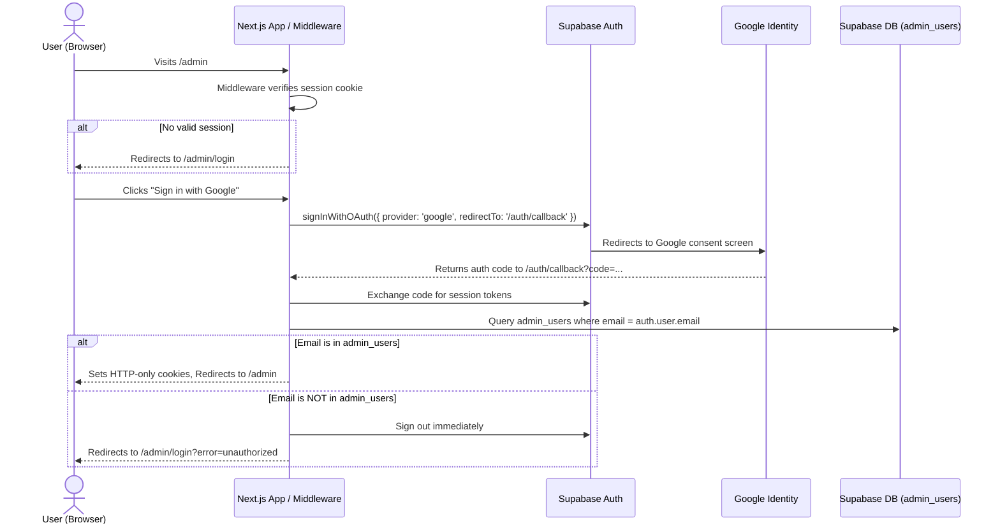

# Slovlog Design Specification: Slovenia Travel Blog

**Date**: 2026-09-24  
**Author**: Shawn Shiobara (`shawn.shiobara@gmail.com`)  
**Domain**: slovlog.com  
**Hosting**: Vercel (Free tier)  
**Database & Media**: Supabase (Free tier)  
**Status**: Approved by User  

---

## 1. System Overview

Slovlog is a high-performance, responsive travel blog dedicated to documenting a trip across Slovenia. It is built to run on Vercel under the custom domain `slovlog.com`, backed by Supabase PostgreSQL for content metadata and Supabase Storage for high-resolution trip photography.

The site is divided into two primary zones:
1. **Public Blog**: A public-facing travel narrative featuring Slovenia's national color identity (Adriatic/Ljubljanica blue, alpine green, crisp snow white), the iconic Ljubljana Dragon emblem, and the Universa Sans typeface. Readers can browse stories, filter by destination, read Markdown entries, and view photography galleries in an interactive lightbox.
2. **Admin CMS (`/admin`)**: A secured management portal accessed exclusively via Google OAuth. Authenticated Google accounts are validated against an `admin_users` whitelist in Supabase, with `shawn.shiobara@gmail.com` hardcoded as the protected super-user/owner. Admins can create, edit, draft, publish, and delete posts, upload and organize media assets, and grant/revoke admin rights for collaborators.

---

## 2. Technical Stack

| Layer | Technology | Rationale |
|---|---|---|
| **Framework** | Next.js 15 (App Router, React 19) | Fast SSR/SSG for public SEO & performance, first-class Vercel integration |
| **Language** | TypeScript | Strong typing for Supabase schema and Next.js route handlers |
| **Styling** | Tailwind CSS 3 / 4 | Utility-first styling with custom Slovenian palette tokens |
| **Database & Auth** | Supabase PostgreSQL + `@supabase/ssr` | Cookie-based session management, Row Level Security (RLS), Google OAuth |
| **Media Storage** | Supabase Storage (`slovlog-media` bucket) | Fast public CDN distribution for travel photos |
| **Typography** | Universa Sans (OTF local font) + Plus Jakarta Sans | Brand identity typeface paired with clean editorial sans fallback |
| **Emblem & Branding** | Ljubljana Dragon (`public/brand/ljubljana-dragon.png`) | Header logo, favicon, touch icon, OpenGraph graphics |
| **Content Editor** | Custom Markdown Editor + Split Live Preview | Low-friction writing with inline media library photo insert |
| **Icons** | Lucide React | Modern, lightweight UI icon library |
| **Notifications** | Sonner | Lightweight toast alerts for admin actions & link copying |

---

## 3. Visual Identity & Design System

### 3.1 Color Palette
* **Slovenian Blue (`slovenia-blue`)**:
  * Default: `#005DA4` (Adriatic & Ljubljanica blue)
  * Dark: `#004880`
  * Deep Navy: `#002447`
* **Alpine Green (`slovenia-green`)**:
  * Forest/Emerald: `#2D6A4F`
  * "I Feel SLOVEnia" Leaf Green: `#78A22F` / `#7BAE37`
* **Neutrals & Canvas**:
  * Canvas White: `#FFFFFF`
  * Alpine Snow Gray: `#F8FAFC`
  * Muted Border: `#E2E8F0`
  * Slate Text: `#0F172A` (headers), `#334155` (body)
* **National Red Accent (`slovenia-red`)**:
  * Triglav Shield Red: `#C8102E` (subtle badges, notification accents)

### 3.2 Typography
* **Universa Sans**: Commissioned font by Type Salon loaded locally using `next/font/local` from `public/fonts/Universa-BF68cb80f2cbb11.otf`. Used for brand titles, headings (h1, h2, h3), hero titles, and destination badges.
* **Plus Jakarta Sans / Inter Fallback**: Used for body paragraphs, Markdown prose, captions, and administrative tables.

### 3.3 Ljubljana Dragon Emblem
* Sourced from the local asset at `/home/shawn/Downloads/ljubljana_dragon_symbol.png`.
* Placed in `public/brand/ljubljana-dragon.png` and `public/favicon.ico`.
* Rendered in the top navigation header alongside the **slovlog** logotype, in the footer, and on social preview cards.

---

## 4. Database Schema & Storage Architecture

### 4.1 PostgreSQL Schema (`supabase/migrations/20260924_init.sql`)

```sql
-- 1. Admin Users Table
create table public.admin_users (
  id uuid primary key default gen_random_uuid(),
  email text unique not null,
  role text not null check (role in ('owner', 'admin')) default 'admin',
  created_at timestamptz not null default now()
);

-- Seed Shawn Shiobara as protected Owner
insert into public.admin_users (email, role)
values ('shawn.shiobara@gmail.com', 'owner')
on conflict (email) do nothing;

-- 2. Posts Table
create table public.posts (
  id uuid primary key default gen_random_uuid(),
  slug text unique not null,
  title text not null,
  excerpt text,
  content text not null default '',
  cover_image text,
  location text,
  trip_date date not null default current_date,
  published boolean not null default false,
  featured boolean not null default false,
  gallery_images text[] not null default '{}',
  created_at timestamptz not null default now(),
  updated_at timestamptz not null default now()
);

create index posts_slug_idx on public.posts (slug);
create index posts_published_trip_date_idx on public.posts (published, trip_date desc);

-- 3. Media Metadata Table
create table public.media (
  id uuid primary key default gen_random_uuid(),
  file_name text not null,
  file_path text not null,
  public_url text not null,
  mime_type text,
  size_bytes bigint,
  caption text,
  location text,
  created_at timestamptz not null default now()
);

-- 4. Row Level Security (RLS)
alter table public.admin_users enable row level security;
alter table public.posts enable row level security;
alter table public.media enable row level security;

-- Function to test if current auth session email is an admin
create or replace function public.is_admin()
returns boolean security definer as $$
begin
  return exists (
    select 1 from public.admin_users
    where email = lower(auth.jwt()->>'email')
  );
end;
$$ language plpgsql;

-- Policies: admin_users
create policy "Admins can view admin list" on public.admin_users
  for select using (public.is_admin());

create policy "Admins can insert new admins" on public.admin_users
  for insert with check (public.is_admin());

create policy "Admins can delete non-owner admins" on public.admin_users
  for delete using (public.is_admin() and role <> 'owner');

-- Policies: posts
create policy "Public can view published posts" on public.posts
  for select using (published = true);

create policy "Admins have full access to posts" on public.posts
  for all using (public.is_admin());

-- Policies: media
create policy "Public can view media" on public.media
  for select using (true);

create policy "Admins have full access to media" on public.media
  for all using (public.is_admin());
```

### 4.2 Supabase Storage Configuration
* **Bucket**: `slovlog-media` (Public bucket)
* **Storage Policies**:
  * `SELECT`: Public access allowed to view images.
  * `INSERT`, `UPDATE`, `DELETE`: Restricted to authenticated admins (`public.is_admin()`).

---

## 5. Authentication & Access Control Flow



### Owner Protection Rule:
The admin management interface strictly blocks deleting or demoting `shawn.shiobara@gmail.com`, ensuring administrative access is never locked out.

---

## 6. Route & Feature Specifications

### 6.1 Public Application
* **Header**:
  * Brand mark: Ljubljana Dragon logo (40px) + "slovlog" in Universa Sans.
  * Links: "Stories", "Destinations", "About".
  * Slovenian tricolor accent strip (`#005DA4`, `#FFFFFF`, `#C8102E` with alpine green `#78A22F`).
* **Home Page (`/`)**:
  * Hero Section: Welcome banner with dragon emblem and tagline: *"A journey through the green heart of Europe"*.
  * Destination Filters: Quick pills for Ljubljana, Lake Bled, Lake Bohinj, Soča Valley, Piran, Triglav National Park.
  * Featured Story Hero Card: Large cover photo, trip date, location badge, read story CTA.
  * Story Grid: Chronological cards with responsive cover image, date, reading time, excerpt.
* **Story Reader (`/posts/[slug]`)**:
  * Trip metadata: Exact trip date (e.g. "September 18, 2026"), destination tag with map pin, reading duration.
  * Rich Markdown renderer: Headings, blockquotes, drop-caps, embedded media.
  * Photo Gallery: Multi-image responsive grid with click-to-zoom Lightbox.
  * Story Pagination: Previous and Next journey entries.
* **About Page (`/about`)**:
  * Journey itinerary, Slovenia travel tips, author bio, and interactive destination summary.

### 6.2 Admin CMS
* **Login (`/admin/login`)**:
  * Clean, dragon-branded card.
  * Google OAuth sign-in button.
  * Clear alert states for unauthorized attempts.
* **Dashboard (`/admin`)**:
  * Metric cards: Total Posts, Published, Drafts, Media Count.
  * Quick-launch buttons: "New Story", "Upload Media", "Manage Admins".
  * Recent activity feed.
* **Posts Manager (`/admin/posts`)**:
  * Filterable table with search, status pills (Published / Draft), destination tags, and date.
  * Actions: Edit, Publish/Unpublish toggle, Delete (modal confirmed).
* **Post Editor (`/admin/posts/new` & `[id]/edit`)**:
  * Form fields: Title, Slug (auto-slugified from title), Destination, Trip Date picker, Excerpt.
  * Cover image selector from media library.
  * Split-view Markdown Editor:
    * Left: Textarea with toolbar (Bold, Italic, H1, H2, Quote, List, Link, Image).
    * Right: Live rendered preview.
    * "Insert Media" modal button: Browse uploaded photos and insert Markdown image tags directly at cursor.
  * Gallery Manager: Attach multiple photos from media library to post's gallery array.
  * Status checkboxes: "Published" and "Featured".
* **Media Library (`/admin/media`)**:
  * Multi-file drag-and-drop uploader.
  * Uploads directly to Supabase Storage bucket `slovlog-media` and creates `media` DB record.
  * Grid display with image thumbnail, file size, upload date.
  * "Copy URL" button with instant toast notification.
  * Delete media button.
* **Admin Users (`/admin/users`)**:
  * Admin list table: Email, Role, Added Date.
  * Add Admin form: Input Google email and assign role (`admin`).
  * Remove Admin button (disabled for `shawn.shiobara@gmail.com`).

---

## 7. Deployment & Configuration

### 7.1 Environment Variables
```env
# Next.js Public (Safe for client)
NEXT_PUBLIC_SUPABASE_URL="https://your-project.supabase.co"
NEXT_PUBLIC_SUPABASE_ANON_KEY="your-anon-key"
NEXT_PUBLIC_SITE_URL="https://slovlog.com"

# Supabase Service Role (Server-only for admin operations if needed)
SUPABASE_SERVICE_ROLE_KEY="your-service-role-key"

# Protected Super-Admin Email
INITIAL_ADMIN_EMAIL="shawn.shiobara@gmail.com"
```

### 7.2 Vercel Deployment Checklist
1. Commit all files and push to `origin main` on GitHub (`max38tech/slovlog`).
2. In Vercel, import `max38tech/slovlog`.
3. Link domain `slovlog.com` and configure DNS.
4. Add environment variables in Vercel project settings.
5. In Supabase Dashboard:
   * Execute `supabase/migrations/20260924_init.sql`.
   * Under **Authentication -> URL Configuration**, set Site URL to `https://slovlog.com` (and `http://localhost:3000` for local dev) and add Redirect URL `https://slovlog.com/auth/callback`.
   * Enable Google Provider with Google Cloud OAuth Client ID and Secret.
